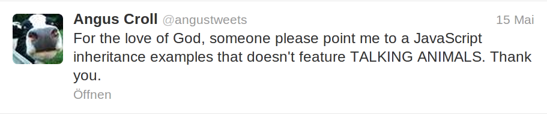

.<div class="slide">

# Inheritance



.</div><div class="slide">

# Inheritance Patterns/Types

Many ways - too many ways to fall...

.<br/><table class="fs75"><tr><td>

 * Constructor Pattern
 * Prototype Pattern
 * Combination Constructor/ Prototype Pattern
 * Dynamic Prototype Pattern
 * Parasitic Constructor Pattern
 * Durable Constructor Pattern

.</td><td style="padding-left: 1em">

 * Prototype Chaining
 * Constructor Stealing
 * **Combination Inheritance**
 * Prototypal Inheritance
 * Parasitic Inheritance
 * <span style="color:green">Parasitic Combination Inheritance</span>

.</td></tr></table>

<span style="color: #aaa" class="fs66">see "Professional JavaScript for Web Developers", Wrox Press</span>

.</div><div class="slide">

# Constructor Function

``` javascript
function LatLng(lat, lng) {
  this.lat = lat;
  this.lng = lng;
}

var myHome = new LatLng(47.8239, 12.0946);

console.log(myHome);
// { lat: 47.8239, lng: 12.0946 }
```

.</div><div class="slide">

# Member Functions

``` javascript
LatLng.prototype.toString = function () {
  return 'LatLng: ' + this.lat + ';' + this.lng;
};

LatLng.prototype.getLat = function () {
  return this.lat;
};

LatLng.prototype.getLng = function () {
  return this.lng;
};
```

.</div><div class="slide">

# Subtype

## Combination Inheritance

``` javascript
function POI(lat, lng, name) {
  // Constructor Stealing
  LatLng.call(this, lat, lng);
  this.name = name;
}

POI.prototype = new LatLng(); // not the best way!

// correct constructor pointer
POI.prototype.constructor = POI;
```

.</div><div class="slide">

# Add / Override Methods

``` javascript
// overrides LatLng::toString
POI.prototype.toString = function () {
  return 'POI: ' + this.name
};

// add new method
POI.prototype.getName = function () {
  return this.name
};

var saltys = new POI(47.587, -122.378, 'Saltys');
```

.</div>
