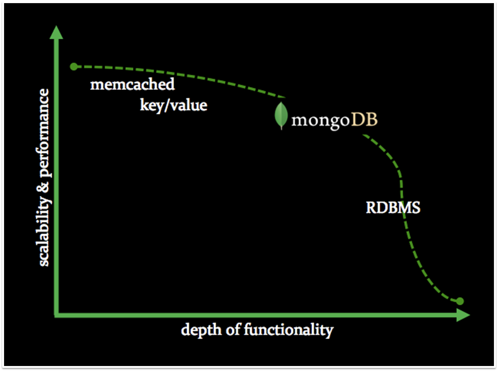

# What is MongoDB?

 * Document Oriented
 * Horizontally Scalable
 * High Performance
 * Operational Datastore

.   

## Focus of MongoDB

 * Create a full-featured data store
 * that is scalable,
 * flexible
 * and fast

  (from: MongoDB The Definitive Guide, O'Reilly)

.   

# Some facts

 * Programmed in C++
 * Open Source (available on GitHub)
 * GNU APGL licensed
 * Runs on Linux, MacOS, Windows, ...
 * Developed by 10gen (<http://www.10gen.com/>)
   * Professional Support
   * First Class Documentation

# Database Landscape

# Terminology

<table class="info">
<thead>
<tr><th>RDBMS</th><th>Mongo</th></tr>
</thead>
<tbody>
<tr><td>Table</td><td>Collection</td></tr>
<tr><td>Row(s)</td><td>BSON Document</td></tr>
<tr><td>Column</td><td>BSON Field</td></tr>
<tr><td>Index</td><td>Index</td></tr>
<tr><td>Join</td><td>Embedded Document</td></tr>
<tr><td>Partition</td><td>Shard</td></tr>
<tr><td>Partition Key</td><td>Shard Key</td></tr>
</tbody>
</table>

